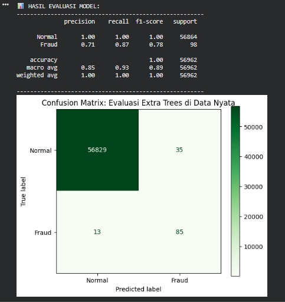

# 💳 Pancaniti ET: Credit Card Fraud Scrutiny System V1.0

***Pancaniti ET: Credit Card Fraud Scrutiny System V1.0*** adalah sistem deteksi penipuan kartu kredit berbasis *Machine Learning* yang dirancang khusus untuk menangani masalah ketidakseimbangan data *(imbalanced data)* secara ekstrem. Dengan mengombinasikan algoritma Extra Trees Classifier dan pendekatan ***Hybrid Resampling (SMOTE + Udersampling)***, sistem ini mampu mengenali pola transaksi mencurigakan dengan presisi di tengah jutaan transaksi normal.Proyek ini menggunakan dataset dari Kaggle ("mlg-ulb/creditcardfraud") yang menerapkan standar ***Principal Component Analysis (PCA)*** untuk melindungi privasi dan data sensitif pelanggan. Melalui teknik ini, fitur-fitur asli ditransformasikan menjadi variabel numerik ($V1, V2, ..., V28$) untuk menjaga kerahasiaan informasi tanpa menghilangkan karakteristik penting dalam pendeteksian pola transaksi.

---

## 🚀 Fitur Utama
* **Automated Benchmarking**: Menggunakan `LazyPredict` untuk mengadu lebih dari 30 algoritma klasifikasi secara otomatis guna menemukan model terbaik.
* **Hybrid Resampling**: Solusi cerdas untuk menangani data yang sangat tidak seimbang, di mana transaksi penipuan hanya sebesar 0.173% dari total data.
* **Extra Trees Power**: Memanfaatkan algoritma *Ensemble Learning* yang tangguh dan efisien untuk klasifikasi data fraud.
* **Integrated Deployment**: Model dikemas menggunakan `joblib` dan diunggah langsung ke **Hugging Face Hub**.

---

## 🧠 Metodologi: Penjelasan Hybrid Resampling
Masalah utama dalam deteksi penipuan adalah **Data Jomplang**. Dalam dataset ini, terdapat 284.315 transaksi normal banding 492 transaksi penipuan. Jika AI dilatih langsung, ia akan cenderung menebak "Normal" terus-menerus karena itu cara termudah untuk mendapatkan akurasi tinggi.

Untuk mengatasinya, proyek ini menggunakan teknik **Hybrid Resampling** (Gabungan SMOTE + Undersampling):

### 1. SMOTE (Oversampling pada data Minoritas)
Kita tidak sekadar menduplikasi data penipuan yang sedikit, tapi **menciptakan data penipuan baru yang sintetis**. SMOTE melihat pola di antara transaksi penipuan yang ada, lalu membuat "titik data baru" yang mirip di sekitarnya. Ini memberi model lebih banyak contoh untuk dipelajari.

### 2. Random Undersampling (pada data Mayoritas)
Setelah data penipuan ditambah secara sintetis, kita **mengurangi sebagian data transaksi normal**. Tujuannya agar jumlah data normal tidak terlalu mendominasi memori model, sehingga model bisa fokus melihat perbedaan tipis antara transaksi asli dan palsu.

**Hasilnya?** Model memiliki proporsi data yang lebih seimbang untuk proses belajar yang jauh lebih adil dan akurat.

---

## 🛠️ Tech Stack
* **Language**: Python 
* **Libraries**: 
    * `Scikit-learn` (Modeling & Scaling) 
    * `Imbalanced-learn` (SMOTE & Undersampling) 
    * `LazyPredict` (Auto-ML Benchmarking) 
    * `XGBoost` & `Pandas` (Data Manipulation) 
    * `Joblib` (Model Packaging) 
* **Deployment**: Hugging Face Hub 

---

## 📊 Hasil Evaluasi
Berdasarkan pengujian pada *test set* murni (data yang tidak dimodifikasi), model **Extra Trees** memberikan performa deteksi yang solid, yang divisualisasikan melalui Confusion Matrix dan Classification Report untuk memastikan tingkat *recall* yang tinggi pada transaksi fraud.

  

---

## 💻 Cara Penggunaan
1. **Persiapkan Lingkungan**: Pastikan library seperti `scikit-learn`, `imbalanced-learn`, dan `lazypredict` sudah terinstal.
2. **Jalankan Notebook**: Ikuti tahapan dari akuisisi dataset Kaggle, preprocessing dengan `RobustScaler`, hingga pelatihan model.
3. **Prediksi**: Gunakan model yang telah dilatih untuk memprediksi label transaksi pada data baru.

---

## 🌐 Model Deployment
Model ini tersedia secara publik di Hugging Face. Anda bisa mengakses repositorinya di sini:
👉 **[Hugging Face Repo](https://huggingface.co/Ripanrz/credit-card-fraud-et-v1.0)**

---
***Project dikembangkan sebagai bagian dari eksperimen sistem keamanan finansial berbasis AI.***
